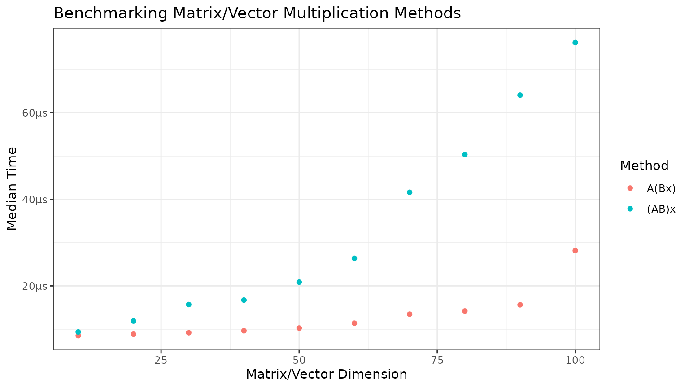
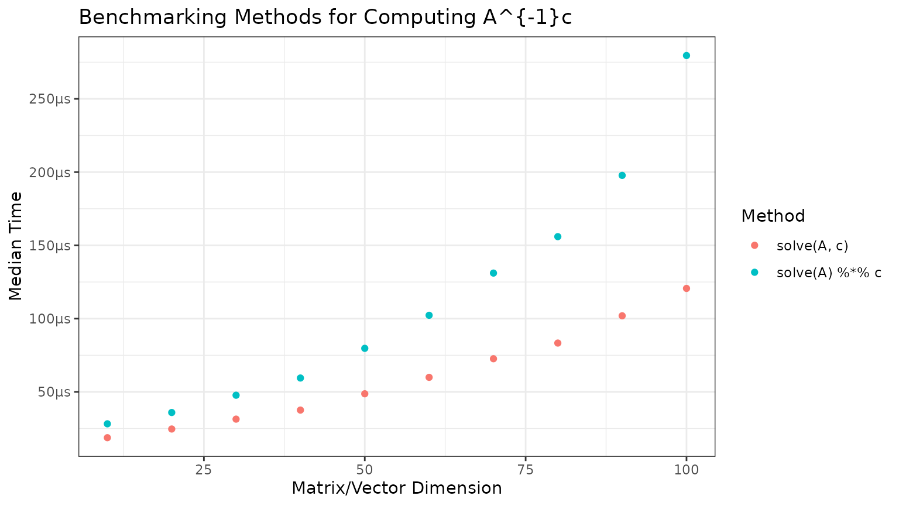

# Homework 1: Benchmarking Methods of Matrix/Vector Multiplication

``` r
library(STATS230)
```

This package contains a function, `mult_ABx`, which takes two square
matrices and a vector and multiplies them together using one of two
methods described below.

For $A,B$ square matrices of the same dimensions and $x$ a conformable
vector:

1.  $A(Bx)$, or the “fast” method. This method first multiplies the
    latter matrix $B$ with the vector, then left-multiplies the former
    matrix $A$. The speed of this method scales as a square of $n$.

2.  $(AB)x$, or the “slow” method. This method first multiplies the
    matrices, then the vector, and the computation speed scales
    cubically with the dimension $n$.

We can use microbenchmarking to demonstrate the differences in speed of
the two methods. We can generate matrices and vectors with random
entries, varying the dimensions to show how the methods scale.

``` r
# Use bench package for microbenchmarking
# bench::press to press results over many dimensions
benchmarks <- bench::press(
  dims = seq(10, 100, by = 10),
  {
    A <- matrix(rnorm(dims^2), nrow = dims)
    B <- matrix(rnorm(dims^2), nrow = dims)
    x <- rnorm(dims)
    # bench::mark to do the actual benchmarking
    bench::mark("A(Bx)" = mult_ABx(A, B, x),
                "(AB)x" = mult_ABx(A, B, x, slow = TRUE)
    )
  }
)
#> Running with:
#>     dims
#>  1    10
#>  2    20
#>  3    30
#>  4    40
#>  5    50
#>  6    60
#>  7    70
#>  8    80
#>  9    90
#> 10   100

# Plot the results with ggplot
library(ggplot2)
benchmarks <- benchmarks[, c("expression", "dims", "median")]
colnames(benchmarks) <- c("Method", "Dimensions", "CPUTime")
benchmarks$Method <- factor(benchmarks$Method, levels = c("A(Bx)", "(AB)x"))
ggplot(data = benchmarks, aes(x = Dimensions, y = CPUTime, color = Method)) +
  geom_point() +
  labs(title = "Benchmarking Matrix/Vector Multiplication Methods",
       x = "Matrix/Vector Dimension",
       y = "Median Time",
       color = "Method") +
  bench::scale_y_bench_time(base = NULL) +
  theme_bw()
```



## Benchmarking matrix inverse multiplication

The package also contains a second function, `mult_Ainv_c`, which
multiplies the inverse of a square matrix by a vector.

For $A$ a square matrix and $c$ a conformable vector, there are (at
least) two common ways to compute $A^{- 1}c$:

1.  Solve the linear system $Ax = c$ directly (`direct = TRUE`). This
    avoids explicitly forming $A^{- 1}$.

2.  Compute $A^{- 1}$ first and then multiply by $c$ (`direct = FALSE`).
    This is usually slower and can be less numerically stable.

As before, we can use microbenchmarking to compare these two approaches
across matrix dimensions.

``` r
benchmarks2 <- bench::press(
  dims = seq(10, 100, by = 10),
  {
    A <- matrix(rnorm(dims^2), nrow = dims)
    c <- rnorm(dims)
    bench::mark(
      "solve(A, c)" = mult_Ainv_c(A, c, direct = TRUE),
      "solve(A) %*% c" = mult_Ainv_c(A, c, direct = FALSE)
    )
  }
)
#> Running with:
#>     dims
#>  1    10
#>  2    20
#>  3    30
#>  4    40
#>  5    50
#>  6    60
#>  7    70
#>  8    80
#>  9    90
#> 10   100

benchmarks2 <- benchmarks2[, c("expression", "dims", "median")]
colnames(benchmarks2) <- c("Method", "Dimensions", "CPUTime")
benchmarks2$Method <- factor(benchmarks2$Method, levels = c("solve(A, c)", "solve(A) %*% c"))

ggplot(data = benchmarks2, aes(x = Dimensions, y = CPUTime, color = Method)) +
  geom_point() +
  labs(title = "Benchmarking Methods for Computing A^{-1}c",
       x = "Matrix/Vector Dimension",
       y = "Median Time",
       color = "Method") +
  bench::scale_y_bench_time(base = NULL) +
  theme_bw()
```


