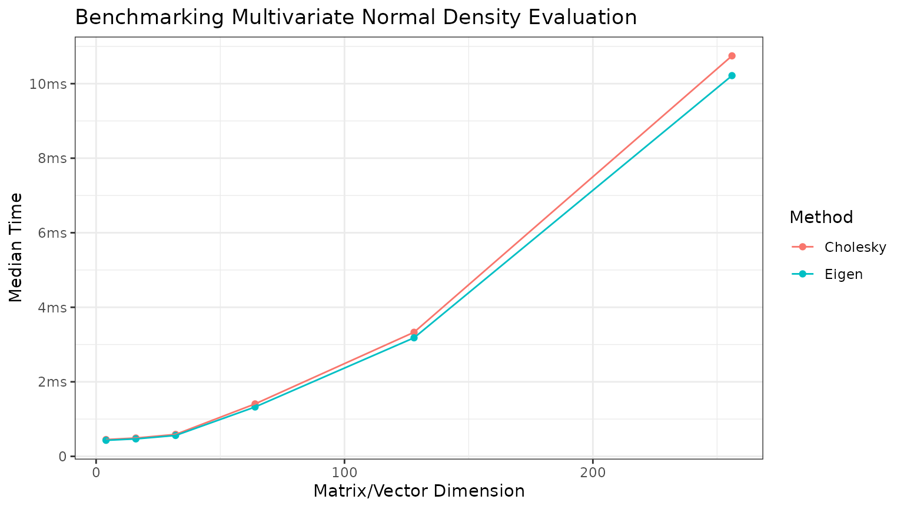
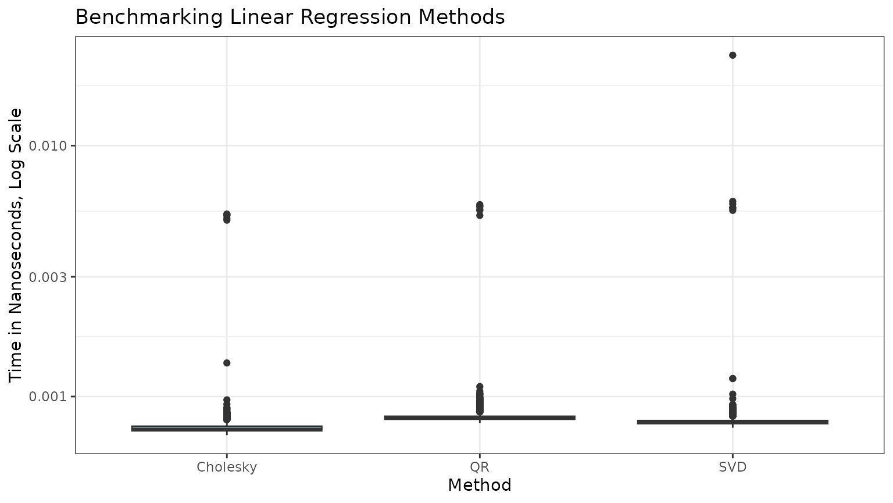

# Homework 2: Matrix Decomposition

``` r
library(STATS230)
```

## Problem 1: Simulate Multivariate Normal Random Vectors (Cholesky)

This package contains a function, `rmvnorm`, that simulates from a
multivariate normal distribution. Here, we will informally validate it
using sample mean/covariances computations.

``` r
# Simulate 100 realizations of a 4-dimensional multivariate normal distribution
set.seed(12345)
# Generate a mean vector
mu <- rpois(4, 1)
# Generate a covariance matrix
A <- matrix(rpois(16, 1), nrow = 4)
A[upper.tri(A)] <- 0
Sigma <- crossprod(A)

# Simulate from the multivariate normal distribution
mvn_sims <- rmvnorm(mean = mu,
                    cov = Sigma,
                    N = 100)

# Compute the sample mean and compare
sample_means <- rowMeans(mvn_sims)
compare_means <- data.frame("True" = mu,
                            "Sample" = sample_means,
                            "Relative Difference" = (mu - sample_means) / mu)
kableExtra::kable(compare_means)
```

| True |   Sample | Relative.Difference |
|-----:|---------:|--------------------:|
|    1 | 1.163559 |          -0.1635593 |
|    2 | 2.756959 |          -0.3784795 |
|    2 | 2.241915 |          -0.1209577 |
|    2 | 2.424408 |          -0.2122041 |

``` r

# Compute sample covariance
sample_covs <- cov(t(mvn_sims))

# Create tables
kableExtra::kable(Sigma, digits = 3, caption = "True Sigma") |>
  kableExtra::kable_styling(full_width = FALSE)
```

|     |     |     |     |
|----:|----:|----:|----:|
|   2 |   0 |   1 |   3 |
|   0 |  16 |   0 |   0 |
|   1 |   0 |   2 |   3 |
|   3 |   0 |   3 |   9 |

True Sigma

``` r
kableExtra::kable(sample_covs, digits = 3, caption = "Sample Covariance") |>
  kableExtra::kable_styling(full_width = FALSE)
```

|        |        |        |        |
|-------:|-------:|-------:|-------:|
|  1.991 | -0.623 |  1.030 |  3.035 |
| -0.623 | 15.840 | -0.290 | -1.000 |
|  1.030 | -0.290 |  2.060 |  3.167 |
|  3.035 | -1.000 |  3.167 |  9.619 |

Sample Covariance

## Problem 2: Evaluate Multivariate Normal Density (Cholesky and Eigen)

This package contains a function, `dmvnorm`, that evaluates the density
of a multivariate normal distribution. In this vignette, we will run the
function a few times at different dimensions to see how the runtime
scales.

``` r
# Use bench package for microbenchmarking
# bench::press to press results over many dimensions
set.seed(12345)
benchmarks <- bench::press(
  dims = c(4, 16, 32, 64, 128, 256),
  {
    x <- rep(0, dims)
    mu <- rep(0, dims)
    A <- matrix(rnorm(dims^2), nrow = dims)
    A[upper.tri(A)] <- 0
    Sigma <- crossprod(A) + diag(dims) * 0.01

    bench::mark(
      "Cholesky" = dmvnorm(x, mu, Sigma),
      "Eigen" = dmvnorm(x, mu, Sigma, method = "eigen")
    )
  }
)
#> Running with:
#>    dims
#> 1     4
#> 2    16
#> 3    32
#> 4    64
#> 5   128
#> 6   256

# Plot the results with ggplot
library(ggplot2)
benchmarks <- benchmarks[, c("dims", "median", "expression")]
colnames(benchmarks) <- c("Dimensions", "CPUTime", "Method")
benchmarks$Method <- as.character(benchmarks$Method)
ggplot(data = benchmarks, aes(x = Dimensions, y = CPUTime, color = Method)) +
  geom_point() +
  geom_line() +
  labs(title = "Benchmarking Multivariate Normal Density Evaluation",
       x = "Matrix/Vector Dimension",
       y = "Median Time") +
  bench::scale_y_bench_time(base = NULL) +
  theme_bw()
```



## Problem 3: OLS Regression via Matrix Decomposition

## Compare STATS230 `my_lm()` using Cholesky, QR, and SVD with `lm()`

``` r
# load data
data <- read.csv(system.file("homework2_regression.csv",
                             package = "STATS230"))

# run each regression
# use 0 + in formula because we already have a column for intercept
chol_lm <- my_lm(y ~ 0 + ., data = data, method = "chol", se = TRUE)
qr_lm <- my_lm(y ~ 0 + ., data = data, method = "qr", se = TRUE)
svd_lm <- my_lm(y ~ 0 + ., data = data, method = "svd", se = TRUE)
stats_lm <- stats::lm(y ~ 0 + ., data = data) # note that lm does qr by default

# compare the coefficients in a table
kableExtra::kable(
  data.frame(
    chol = chol_lm$coefficients,
    qr = qr_lm$coefficients,
    svd = svd_lm$coefficients,
    stats = stats_lm$coefficients
  ),
  caption = "Comparison of coefficients from different methods"
)
```

|     |       chol |         qr |        svd |      stats |
|:----|-----------:|-----------:|-----------:|-----------:|
| x1  | -0.0500634 | -0.0500634 | -0.0500634 | -0.0500634 |
| x2  | -2.0587331 | -2.0587331 | -2.0587331 | -2.0587331 |
| x3  | -0.8897836 | -0.8897836 | -0.8897836 | -0.8897836 |
| x4  |  0.8698562 |  0.8698562 |  0.8698562 |  0.8698562 |
| x5  |  3.1046126 |  3.1046126 |  3.1046126 |  3.1046126 |

Comparison of coefficients from different methods

``` r

# compare the standard errors in a table
kableExtra::kable(
  data.frame(
    chol = chol_lm$standard_errors,
    qr = qr_lm$standard_errors,
    svd = svd_lm$standard_errors,
    stats = summary(stats_lm)$coefficients[, "Std. Error"]
  ),
  caption = "Comparison of standard errors from different methods"
)
```

|     |      chol |        qr |       svd |     stats |
|:----|----------:|----------:|----------:|----------:|
| x1  | 0.0622607 | 0.0622607 | 0.0622607 | 0.0622607 |
| x2  | 0.0893586 | 0.0893586 | 0.0893586 | 0.0893586 |
| x3  | 0.0896073 | 0.0896073 | 0.0896073 | 0.0896073 |
| x4  | 0.1048649 | 0.1048649 | 0.1048649 | 0.1048649 |
| x5  | 0.0896658 | 0.0896658 | 0.0896658 | 0.0896658 |

Comparison of standard errors from different methods

## Benchmark the performance of `my_lm()` using Cholesky, QR, and SVD

``` r
benchmarks <- bench::mark(
  "Cholesky" = my_lm(y ~ 0 + ., data, "chol"),
  "QR" = my_lm(y ~ 0 + ., data, "qr"),
  "SVD" = my_lm(y ~ 0 + ., data, "svd"),
  iterations = 1000
)

benchmark_times <- do.call(c, benchmarks$time)
benchmarks_df <- data.frame(
  method = rep(names(benchmarks$expression), each = 1000),
  time = benchmark_times
)
ggplot(benchmarks_df, aes(x = method, y = time)) +
  geom_boxplot(fill = "lightblue") +
  labs(title = "Benchmarking Linear Regression Methods",
       x = "Method",
       y = "Time in Nanoseconds, Log Scale") +
  theme_bw() +
  scale_y_log10()
```



Recall the computational complexities of Cholesky, QR, and SVD are
$\mathcal{O}\left( np^{2} + p^{3} \right)$,
$\mathcal{O}\left( np^{2} \right)$, and
$\mathcal{O}\left( np^{2} + p^{3} \right)$ respectively.

Here, we have a dataset with $n = 300$ and $p = 6$.

## $L_{2}$ Norm-Based Condition Number

``` r
X <- as.matrix(data[, -1])
XTX <- crossprod(X)
lambda <- eigen(XTX)$values
max(lambda) / min(lambda)
#> [1] 3.018046
```

OLS coefficients are computed by
$\widehat{\beta} = \left( X^{T}X \right)^{- 1}X^{T}y$. In this case the
interpretation of the condition number is that the relative error in the
$\widehat{\beta}$s should not exceed approximately 3 times a small
relative perturbation in $X^{T}y$.
