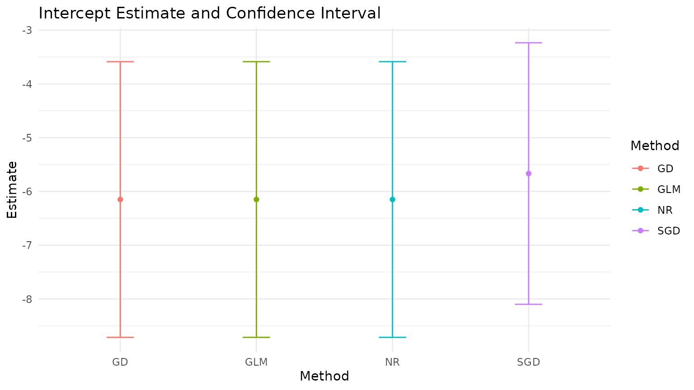
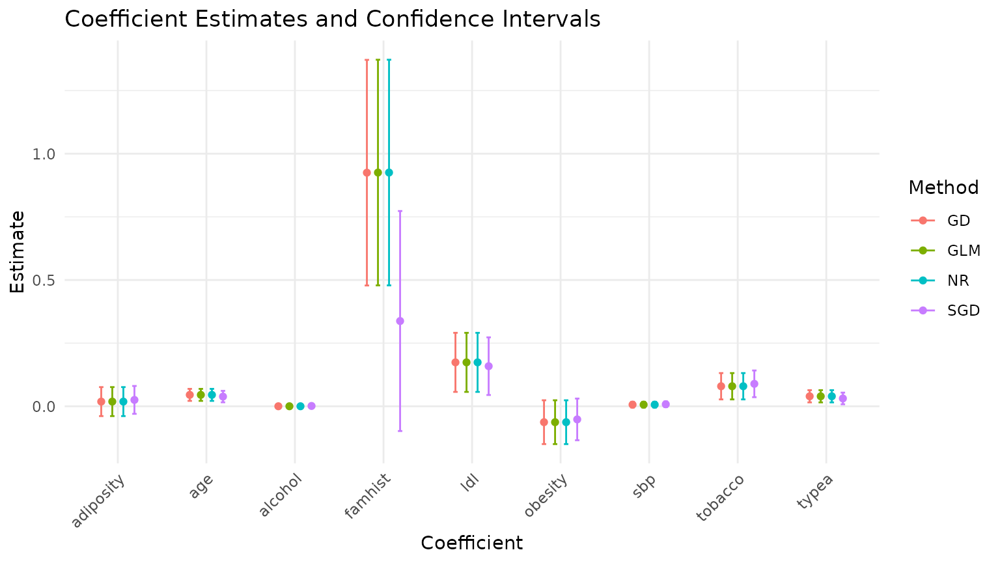

# Homework 3: Optimization Methods for Logistic Regression

First fitting the models, then plotting the coefficients and confidence
intervals.

``` r
library(STATS230)
library(ggplot2)
library(bench)
```

``` r
set.seed(537832)

data <- read.csv(system.file("SAheart.csv",
                             package = "STATS230"),
                 row.names = 1)
data$famhist <- ifelse(data$famhist == "Present", 1, 0)
fit_gd <- fit_logistic(
  chd ~ .,
  data = data,
  method = "gd",
  learning_rate = 0.05,
  max_iterations = 5000
)
fit_sgd <- fit_logistic(
  chd ~ .,
  data = data,
  method = "sgd",
  learning_rate = 0.05,
  decay = 0.01,
  max_iterations = 5000,
  convergence_metric = "beta"
)
#> Warning in run_optimizer_loop(beta0, update_sgd, max_iterations, verbose_every
#> = 100 * : maximum iterations reached without convergence
fit_nr <- fit_logistic(
  chd ~ .,
  data = data,
  method = "nr"
)
fit_glm <- glm(
  chd ~ .,
  data = data,
  family = binomial(link = "logit")
)

fit_gd$coefficients
#>   (Intercept)           sbp       tobacco           ldl     adiposity 
#> -6.1510232498  0.0065029704  0.0793671742  0.1739390350  0.0185496792 
#>       famhist         typea       obesity       alcohol           age 
#>  0.9248621934  0.0395921362 -0.0628573513  0.0001229024  0.0452351873
fit_sgd$coefficients
#>  (Intercept)          sbp      tobacco          ldl    adiposity      famhist 
#> -5.667386282  0.008033983  0.088940137  0.158799463  0.025292286  0.337566600 
#>        typea      obesity      alcohol          age 
#>  0.031029866 -0.051918055  0.001306498  0.038473613
fit_nr$coefficients
#>   (Intercept)           sbp       tobacco           ldl     adiposity 
#> -6.1507208646  0.0065040171  0.0793764457  0.1739238981  0.0185865682 
#>       famhist         typea       obesity       alcohol           age 
#>  0.9253704193  0.0395950250 -0.0629098693  0.0001216624  0.0452253496
coef(fit_glm)
#>   (Intercept)           sbp       tobacco           ldl     adiposity 
#> -6.1507208650  0.0065040171  0.0793764457  0.1739238981  0.0185865682 
#>       famhist         typea       obesity       alcohol           age 
#>  0.9253704194  0.0395950250 -0.0629098693  0.0001216624  0.0452253496
```

``` r
# get coefs
coef_gd <- fit_gd$coefficients
coef_sgd <- fit_sgd$coefficients
coef_nr <- fit_nr$coefficients
coef_glm <- coef(fit_glm)

# get CIs
ci_gd <- fit_gd$conf_int
ci_sgd <- fit_sgd$conf_int
ci_nr <- fit_nr$conf_int
ci_glm <- confint.default(fit_glm)

# combine into df for plotting (one row per coefficient per method)
coef_names <- names(coef_gd)

results <- data.frame(
  Method = rep(c("GD", "SGD", "NR", "GLM"), each = length(coef_names)),
  Coefficient = rep(coef_names, times = 4),
  Estimate = c(coef_gd, coef_sgd, coef_nr, coef_glm),
  CI_Low = c(ci_gd[, 1], ci_sgd[, 1], ci_nr[, 1], ci_glm[, 1]),
  CI_High = c(ci_gd[, 2], ci_sgd[, 2], ci_nr[, 2], ci_glm[, 2])
)

# split intercept vs others because the scales are pretty different
intercept_name <- "(Intercept)"
results_intercept <- subset(results, Coefficient == intercept_name)
results_other <- subset(results, Coefficient != intercept_name)

# plot 1: intercept only
ggplot(results_intercept, aes(x = Method, y = Estimate, color = Method)) +
  geom_point(position = position_dodge(width = 0.5)) +
  geom_errorbar(aes(ymin = CI_Low, ymax = CI_High), position = position_dodge(width = 0.5), width = 0.2) +
  theme_minimal() +
  labs(title = "Intercept Estimate and Confidence Interval",
       x = "Method",
       y = "Estimate")
```



``` r

# plot 2: all other coefficients
ggplot(results_other, aes(x = Coefficient, y = Estimate, color = Method)) +
  geom_point(position = position_dodge(width = 0.5)) +
  geom_errorbar(aes(ymin = CI_Low, ymax = CI_High), position = position_dodge(width = 0.5), width = 0.2) +
  theme_minimal() +
  labs(title = "Coefficient Estimates and Confidence Intervals",
       x = "Coefficient",
       y = "Estimate") +
  theme(axis.text.x = element_text(angle = 45, hjust = 1))
```



Comparing the results, we can see that my SGD implementation gives
fairly different estimates and CIs than the other methods. Why is this?
The log-likelihood plot can answer that…

``` r
loglik_gd <- data.frame(
  Iteration = seq_along(fit_gd$log_likelihood_history),
  LogLikelihood = fit_gd$log_likelihood_history,
  Method = "GD"
)

loglik_sgd <- data.frame(
  Iteration = seq_along(fit_sgd$log_likelihood_history),
  LogLikelihood = fit_sgd$log_likelihood_history,
  Method = "SGD"
)

loglik_nr <- data.frame(
  Iteration = seq_along(fit_nr$log_likelihood_history),
  LogLikelihood = fit_nr$log_likelihood_history,
  Method = "NR"
)

loglik_all <- rbind(loglik_gd, loglik_sgd)

ggplot(loglik_all, aes(x = Iteration, y = LogLikelihood, color = Method)) +
  geom_line() +
  theme_minimal() +
  labs(title = "Log-Likelihood Convergence by Method",
       x = "Iteration",
       y = "Log-Likelihood")
```


``` r

ggplot(loglik_nr, aes(x = Iteration, y = LogLikelihood)) +
  geom_line(color = "blue") +
  theme_minimal() +
  labs(title = "Log-Likelihood Convergence for Newton-Raphson",
       x = "Iteration",
       y = "Log-Likelihood")
```


SGD never converged, which is why the estimates are so different (the
function warned us about this when we ran it). The log-likelihood plot
shows that the log-likelihood was still increasing at the end of the
5000 iterations, so it hadn’t found the maximum yet. The GD and NR
methods converged, which is why their estimates are more similar to each
other and to the GLM results. The NR method converged much faster than
GD, because it uses second-order information to find the optimal step
size, while GD just uses a fixed learning rate. This is a common
pattern: NR often converges in fewer iterations than GD, but each
iteration of NR is more computationally expensive. Let’s compare the
runtimes of the methods to see this.

``` r
# compare time per iteration
max_iter_bench <- 1000

bench_res <- bench::mark(
  GD = suppressWarnings(fit_logistic(
    chd ~ .,
    data = data,
    method = "gd",
    max_iterations = max_iter_bench,
    tolerance = -Inf
  )),
  SGD = suppressWarnings(fit_logistic(
    chd ~ .,
    data = data,
    method = "sgd",
    learning_rate = 0.05,
    decay = 0.01,
    max_iterations = max_iter_bench,
    tolerance = -Inf,
    convergence_metric = "beta"
  )),
  NR = suppressWarnings(fit_logistic(
    chd ~ .,
    data = data,
    method = "nr",
    max_iterations = max_iter_bench,
    tolerance = -Inf
  )),
  check = FALSE,
  iterations = 100
)
#> Warning: Some expressions had a GC in every iteration; so filtering is
#> disabled.

bench_methods <- as.character(bench_res$expression)
time_list <- bench_res$time

time_long <- data.frame(
  Method = rep(bench_methods, lengths(time_list)),
  TimePerIter_ms = (as.numeric(unlist(time_list)) / 1e6) / max_iter_bench
)

ggplot(time_long, aes(x = Method, y = TimePerIter_ms, fill = Method)) +
  geom_boxplot(outlier.shape = 21, outlier.alpha = 0.7) +
  theme_minimal() +
  labs(title = "Time per Iteration by Method",
       x = "Method",
       y = "Time per iteration (ms)") +
  guides(fill = "none")
```


``` r

# also plot without outliers to see the distribution better
ggplot(time_long, aes(x = Method, y = TimePerIter_ms, fill = Method)) +
  geom_boxplot(outlier.shape = NA) +
  coord_cartesian(ylim = c(0, quantile(time_long$TimePerIter_ms, 0.95))) +
  theme_minimal() +
  labs(title = "Time per Iteration by Method (no outliers plotted)",
       x = "Method",
       y = "Time per iteration (ms)") +
  guides(fill = "none")
```


