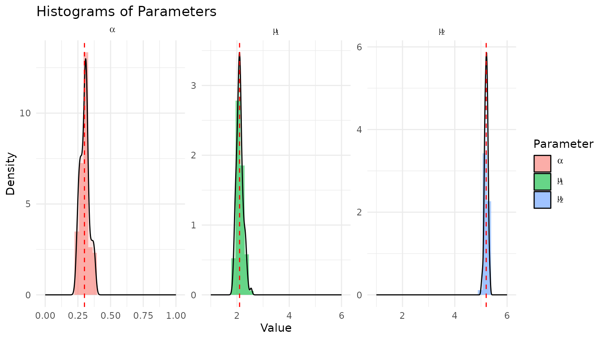
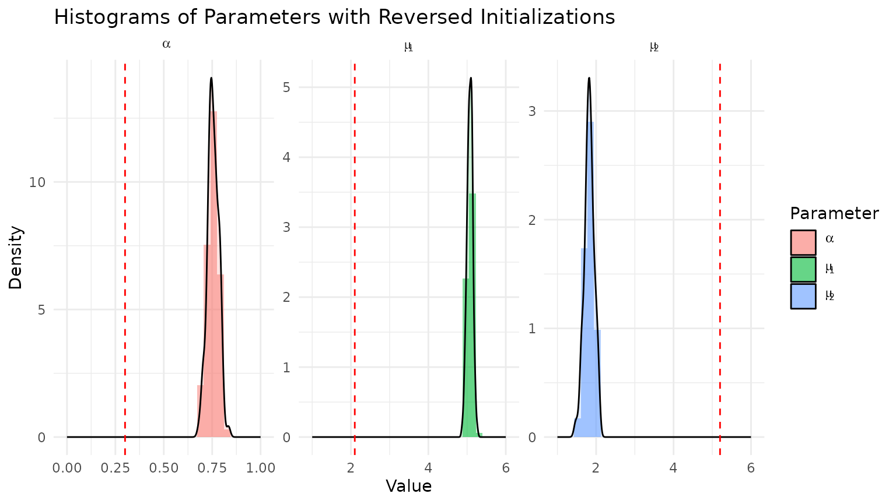
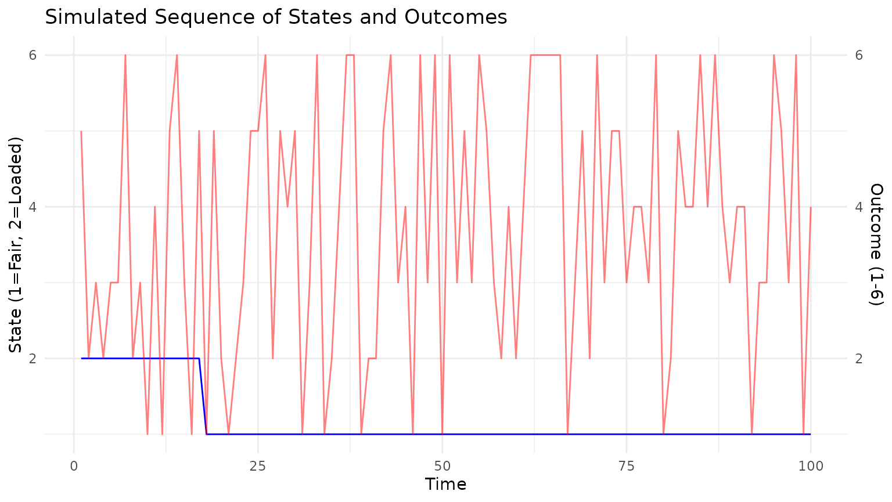
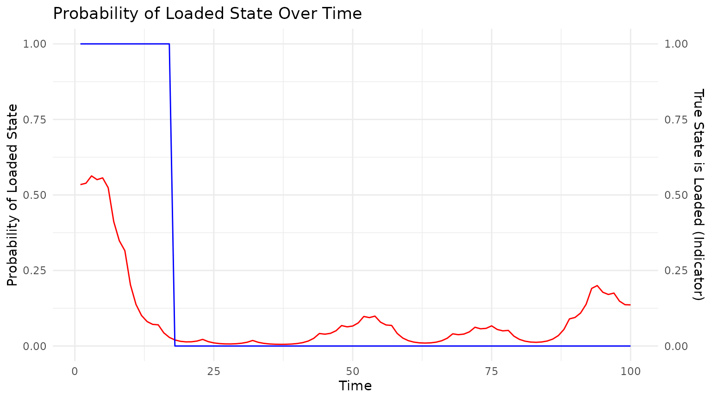

# Homework 4: EM and HMMs

``` r
library(STATS230)
library(ggplot2)
library(bench)
```

### Problem 1: Mixture of Normals

We consider a mixture of two normal distributions with unknown means
$\mu_{1},\mu_{2}$ and known variances $\sigma_{1} = 1.0$,
$\sigma_{2} = 0.8$. Pairs
$\left( x_{1},y_{1} \right),\ldots,\left( x_{n},y_{n} \right)$ are
i.i.d. with joint distribution

$$\Pr\left( x_{i},y_{i} \right) = \left\lbrack \alpha f\left( y_{i},\mu_{1},\sigma_{1} \right) \right\rbrack^{\mathbf{1}\{ x_{i} = 1\}}\left\lbrack (1 - \alpha)f\left( y_{i},\mu_{2},\sigma_{2} \right) \right\rbrack^{\mathbf{1}\{ x_{i} = 2\}},$$

where $x_{i} \in \{ 1,2\}$ is a class membership variable that indicates
which distribution gave rise to $y_{i} \in {\mathbb{R}}$,

$$\Pr\left( x_{i} = 1 \right) = 1 - \Pr\left( x_{i} = 2 \right) = \alpha,$$

and

$$f(x,\mu,\sigma) = \frac{1}{\sigma\sqrt{2\pi}}\exp\left( - \frac{(x - \mu)^{2}}{2\sigma^{2}} \right).$$

We also assume that we observe $y = \left( y_{1},\ldots,y_{n} \right)$
but do not observe $x = \left( x_{1},\ldots,x_{n} \right)$. Our goal is
to infer $\alpha$, $\mu_{1}$, and $\mu_{2}$ by maximizing the observed
data log-likelihood

$$\ell\left( \alpha,\mu_{1},\mu_{2} \right) = \sum\limits_{i = 1}^{n}\ln\left\lbrack \alpha f\left( y_{i},\mu_{1},\sigma_{1} \right) + (1 - \alpha)f\left( y_{i},\mu_{2},\sigma_{2} \right) \right\rbrack.$$

Instead of maximizing the log-likelihood directly, we want to derive an
EM algorithm to get MLEs.

#### (a) Complete log-likelihood

The complete-data likelihood, taking the product over i.i.d. variables,
becomes

$$\Pr\left( \overset{\rightarrow}{x},\overset{\rightarrow}{y} \mid \alpha,\mu_{1},\mu_{2} \right) = \prod\limits_{i = 1}^{n}\lbrack\alpha f\left( y_{i} \mid \mu_{1},\sigma_{1} \right)\rbrack^{\mathbf{1}\{ x_{i} = 1\}}\lbrack(1 - \alpha)f\left( y_{i} \mid \mu_{2},\sigma_{2} \right)\rbrack^{\mathbf{1}\{ x_{i} = 2\}}.$$

Taking logs gives

$$\ln\Pr\left( \overset{\rightarrow}{x},\overset{\rightarrow}{y} \mid \alpha,\mu_{1},\mu_{2} \right) = \sum\limits_{i = 1}^{n}\mathbf{1}\{ x_{i} = 1\}(\ln\alpha + \ln f\left( y_{i} \mid \mu_{1},\sigma_{1} \right)) + \mathbf{1}\{ x_{i} = 2\}(\ln(1 - \alpha) + \ln f\left( y_{i} \mid \mu_{2},\sigma_{2} \right)).$$

Using
$$\ln f(y \mid \mu,\sigma) = - \ln\left( \sigma\sqrt{2\pi} \right) - \frac{(y - \mu)^{2}}{2\sigma^{2}},$$

the complete log-likelihood becomes

$$\begin{aligned}
{\ln\Pr\left( \overset{\rightarrow}{x},\overset{\rightarrow}{y} \mid \alpha,\mu_{1},\mu_{2} \right)} & {= \sum\limits_{i = 1}^{n}\mathbf{1}\{ x_{i} = 1\}\left\lbrack \ln\alpha - \ln\left( \sigma_{1}\sqrt{2\pi} \right) - \frac{\left( y_{i} - \mu_{1} \right)^{2}}{2\sigma_{1}^{2}} \right\rbrack} \\
 & {\quad + \sum\limits_{i = 1}^{n}\mathbf{1}\{ x_{i} = 2\}\left\lbrack \ln(1 - \alpha) - \ln\left( \sigma_{2}\sqrt{2\pi} \right) - \frac{\left( y_{i} - \mu_{2} \right)^{2}}{2\sigma_{2}^{2}} \right\rbrack.}
\end{aligned}$$

#### (b) E-step of the EM algorithm

We want to derive an expression for
$${\mathbb{E}}\!\left\lbrack \ln\Pr\left( \overset{\rightarrow}{x},\overset{\rightarrow}{y} \mid \alpha,\mu_{1},\mu_{2} \right)\; \middle| \;\overset{\rightarrow}{y},\alpha^{(k)},\mu_{1}^{(k)},\mu_{2}^{(k)} \right\rbrack.$$

Here the expectation is taken with respect to the conditional
distribution
$$\Pr\left( \overset{\rightarrow}{x} \mid \overset{\rightarrow}{y},\alpha^{(k)},\mu_{1}^{(k)},\mu_{2}^{(k)} \right).$$
That is, we treat $\overset{\rightarrow}{y}$ and the current parameter
values $\alpha^{(k)},\mu_{1}^{(k)},\mu_{2}^{(k)}$ as fixed, and average
only over the latent class indicators $\overset{\rightarrow}{x}$.

Because the complete log-likelihood is linear in the indicator variables
$\mathbf{1}\{ x_{i} = 1\}$ and $\mathbf{1}\{ x_{i} = 2\}$, taking
expectations simply replaces each indicator with its conditional
probability.

Define
$$p_{i}^{(k)} = \Pr\left( x_{i} = 1 \mid y_{i},\alpha^{(k)},\mu_{1}^{(k)},\mu_{2}^{(k)} \right)$$

For notational convenience. Then we have
$${\mathbb{E}}\left\lbrack \mathbf{1}\{ x_{i} = 1\} \mid y_{i} \right\rbrack = p_{i}^{(k)},\qquad{\mathbb{E}}\left\lbrack \mathbf{1}\{ x_{i} = 2\} \mid y_{i} \right\rbrack = 1 - p_{i}^{(k)}.$$

Therefore the expected complete log-likelihood becomes $$\begin{aligned}
{{\mathbb{E}}\left\lbrack \ln\Pr\left( \overset{\rightarrow}{x},\overset{\rightarrow}{y} \mid \alpha,\mu_{1},\mu_{2} \right) \mid \overset{\rightarrow}{y},\alpha^{(k)},\mu_{1}^{(k)},\mu_{2}^{(k)} \right\rbrack} & {= \sum\limits_{i = 1}^{n}p_{i}^{(k)}\left\lbrack \ln\alpha - \ln\left( \sigma_{1}\sqrt{2\pi} \right) - \frac{\left( y_{i} - \mu_{1} \right)^{2}}{2\sigma_{1}^{2}} \right\rbrack} \\
 & {\quad + \sum\limits_{i = 1}^{n}\left( 1 - p_{i}^{(k)} \right)\left\lbrack \ln(1 - \alpha) - \ln\left( \sigma_{2}\sqrt{2\pi} \right) - \frac{\left( y_{i} - \mu_{2} \right)^{2}}{2\sigma_{2}^{2}} \right\rbrack.}
\end{aligned}$$

The important idea is that the only randomness in the complete-data
log-likelihood comes from the unobserved labels $x_{i}$. The idea behind
EM here is to replace unknown class labels with their current
probabilities, then maximize a weighted log-likelihood to get new
parameter estimates, and repeat until convergence.

### (c) M-step of the EM algorithm

To maximize, we take partial derivatives with respect to $\alpha$,
$\mu_{1}$, and $\mu_{2}$.

With respect to $\alpha$, we have
$$\frac{\partial}{\partial\alpha}{\mathbb{E}}\left\lbrack \ln\Pr\left( \overset{\rightarrow}{x},\overset{\rightarrow}{y} \mid \alpha,\mu_{1},\mu_{2} \right) \mid \overset{\rightarrow}{y},\alpha^{(k)},\mu_{1}^{(k)},\mu_{2}^{(k)} \right\rbrack = \sum\limits_{i = 1}^{n}\frac{p_{i}^{(k)}}{\alpha} - \sum\limits_{i = 1}^{n}\frac{1 - p_{i}^{(k)}}{1 - \alpha} = 0.$$

Solving for $\alpha$, we get
$$\alpha^{(k + 1)} = \frac{\sum\limits_{i = 1}^{n}p_{i}^{(k)}}{n}.$$

Checking the second derivative, we have
$$\frac{\partial^{2}}{\partial\alpha^{2}} = - \sum\limits_{i = 1}^{n}\frac{p_{i}^{(k)}}{\alpha^{2}} - \sum\limits_{i = 1}^{n}\frac{1 - p_{i}^{(k)}}{(1 - \alpha)^{2}} < 0,$$
so the critical point is a maximum.

With respect to $\mu_{1}$, we have
$$\frac{\partial}{\partial\mu_{1}}{\mathbb{E}}\left\lbrack \ln\Pr\left( \overset{\rightarrow}{x},\overset{\rightarrow}{y} \mid \alpha,\mu_{1},\mu_{2} \right) \mid \overset{\rightarrow}{y},\alpha^{(k)},\mu_{1}^{(k)},\mu_{2}^{(k)} \right\rbrack = - \sum\limits_{i = 1}^{n}p_{i}^{(k)}\frac{\left( y_{i} - \mu_{1} \right)}{\sigma_{1}^{2}} = 0.$$

Solving for $\mu_{1}$, we get
$$\mu_{1}^{(k + 1)} = \frac{\sum\limits_{i = 1}^{n}p_{i}^{(k)}y_{i}}{\sum\limits_{i = 1}^{n}p_{i}^{(k)}}.$$

Checking the second derivative, we have
$$\frac{\partial^{2}}{\partial\mu_{1}^{2}} = - \sum\limits_{i = 1}^{n}\frac{p_{i}^{(k)}}{\sigma_{1}^{2}} < 0,$$
so the critical point is a maximum.

With respect to $\mu_{2}$, we have
$$\frac{\partial}{\partial\mu_{2}}{\mathbb{E}}\left\lbrack \ln\Pr\left( \overset{\rightarrow}{x},\overset{\rightarrow}{y} \mid \alpha,\mu_{1},\mu_{2} \right) \mid \overset{\rightarrow}{y},\alpha^{(k)},\mu_{1}^{(k)},\mu_{2}^{(k)} \right\rbrack = - \sum\limits_{i = 1}^{n}\left( 1 - p_{i}^{(k)} \right)\frac{\left( y_{i} - \mu_{2} \right)}{\sigma_{2}^{2}} = 0.$$

Solving for $\mu_{2}$, we get
$$\mu_{2}^{(k + 1)} = \frac{\sum\limits_{i = 1}^{n}\left( 1 - p_{i}^{(k)} \right)y_{i}}{\sum\limits_{i = 1}^{n}\left( 1 - p_{i}^{(k)} \right)}.$$

Checking the second derivative, we have
$$\frac{\partial^{2}}{\partial\mu_{2}^{2}} = - \sum\limits_{i = 1}^{n}\frac{1 - p_{i}^{(k)}}{\sigma_{2}^{2}} < 0,$$
so the critical point is a maximum.

Therefore, the EM algorithm is given by the following updates:
$$\begin{aligned}
p_{i}^{(k)} & {= \Pr\left( x_{i} = 1 \mid y_{i},\alpha^{(k)},\mu_{1}^{(k)},\mu_{2}^{(k)} \right)} \\
 & {= \frac{\alpha^{(k)}f\left( y_{i} \mid \mu_{1}^{(k)},\sigma_{1} \right)}{\alpha^{(k)}f\left( y_{i} \mid \mu_{1}^{(k)},\sigma_{1} \right) + (1 - \alpha^{{(k)})}f\left( y_{i} \mid \mu_{2}^{(k)},\sigma_{2} \right)},\ \qquad i = 1,\ldots,n,} \\
\alpha^{(k + 1)} & {= \frac{\sum\limits_{i = 1}^{n}p_{i}^{(k)}}{n},} \\
\mu_{1}^{(k + 1)} & {= \frac{\sum\limits_{i = 1}^{n}p_{i}^{(k)}y_{i}}{\sum\limits_{i = 1}^{n}p_{i}^{(k)}},} \\
\mu_{2}^{(k + 1)} & {= \frac{\sum\limits_{i = 1}^{n}\left( 1 - p_{i}^{(k)} \right)y_{i}}{\sum\limits_{i = 1}^{n}\left( 1 - p_{i}^{(k)} \right)}.}
\end{aligned}$$

### (d) Implementation and example using `mixture_data.txt`

The EM algorithm is implemented in the function
[`em_mixture_normals()`](https://uci-stats230-2026.github.io/stats230-r-package-example/reference/em_mixture_normals.md).
The function takes as input a vector of observations `y`, initial
parameter values `alpha_init`, `mu1_init`, and `mu2_init`, and a maximum
number of iterations `max_iter`. The function returns a list containing
the final parameter estimates and the log-likelihood at each iteration.

``` r
y <- as.vector(read.table(system.file("mixture_data.txt",
                                      package = "STATS230")))[[1]]
rslt <- em_mixture_normals(y)
print(rslt)
#> $alpha
#> [1] 0.3002875
#> 
#> $mu1
#> [1] 1.903574
#> 
#> $mu2
#> [1] 6.027247
#> 
#> $loglik
#>  [1] -575.5030 -567.0335 -566.2514 -566.1876 -566.1826 -566.1822 -566.1822
#>  [8] -566.1822 -566.1822 -566.1822 -566.1822 -566.1822 -566.1822 -566.1822
#> [15] -566.1822 -566.1822
#> 
#> $converged
#> [1] TRUE
#> 
#> $iterations
#> [1] 16
```

### (e) Simulation study

Now, we will test the performance of our EM algorithm by simulating data
from a known mixture of normals and checking if we can recover the true
parameters.

``` r
set.seed(123)

# True parameters
alpha_true <- 0.3
mu1_true <- 2.1
mu2_true <- 5.2
sigma1 <- 1
sigma2 <- 0.8
datasets <- 100
n_obs <- 300

results_list <- vector("list", length = datasets)
for (d in 1:datasets) {
  # Simulate data
  x <- rbinom(n_obs, size = 1, prob = 1 - alpha_true) + 1  # x_i = 1 or 2
  y <- ifelse(x == 1,
              rnorm(n_obs, mean = mu1_true, sd = sigma1),
              rnorm(n_obs, mean = mu2_true, sd = sigma2))

  # Run EM algorithm on simulated data
  rslt_sim <- em_mixture_normals(y,
                                 mu1_init = quantile(y, 0.25),
                                 mu2_init = quantile(y, 0.75),
                                 sigma1 = sigma1, sigma2 = sigma2)

  # Store results
  results_list[[d]] <- list(
    alpha = rslt_sim$alpha,
    mu1 = rslt_sim$mu1,
    mu2 = rslt_sim$mu2
  )
}
```

Now, we plot the results from above:


Notice that, above, we initialized the EM algorithm with the 25th and
75th percentiles of the data for `mu1_init` and `mu2_init`,
respectively. Let’s see how the results change if we do the opposite:

``` r
# Run EM algorithm with reversed initializations
results_list_reversed <- vector("list", length = datasets)
for (d in 1:datasets) {
  # Simulate data
  x <- rbinom(n_obs, size = 1, prob = 1 - alpha_true) + 1  # x_i = 1 or 2
  y <- ifelse(x == 1,
              rnorm(n_obs, mean = mu1_true, sd = sigma1),
              rnorm(n_obs, mean = mu2_true, sd = sigma2))
  # Run EM algorithm on simulated data with reversed initializations
  rslt_sim <- em_mixture_normals(y,
                                 mu1_init = quantile(y, 0.75),
                                 mu2_init = quantile(y, 0.25),
                                 sigma1 = sigma1, sigma2 = sigma2)
  # Store results
  results_list_reversed[[d]] <- list(
    alpha = rslt_sim$alpha,
    mu1 = rslt_sim$mu1,
    mu2 = rslt_sim$mu2
  )
}
```



Now, everything’s reversed! This is known as the “label switching”
problem because the likelihood is symmetric in $\mu_{1}$ and $\mu_{2}$,
so the EM algorithm can converge to either mode depending on the
initialization. To fix this issue, we can enforce a consistent labeling
convention, such as always labeling the component with the smaller mean
as component 1. This way, we will always have $\mu_{1} < \mu_{2}$, and
the algorithm will converge to the same mode regardless of
initialization.

Going back to our original results, the question asked for the bias of
$\widehat{\alpha}$ and its associated Monte Carlo error:

    #> Bias of alpha: 0.002112956
    #> Monte Carlo error of alpha: 0.003439607

The bias is small relative to $\alpha$, and the Monte Carlo error is
larger than the bias, suggesting that the estimator is unbiased.

## Problem 2: Hidden Markov Model (Occasionally Dishonest Casino)

The setup of this question is that we are at a casino that sometimes
uses a fair die, and sometimes uses a loaded die, and they randomly
switch between the two. Initially, the casino selects one of the dice
uniformly randomly (i.e., with 1/2 probability for each). We are given
the transition probabilities between the two states (1 = fair die, 2 =
loaded die) and the probabilities of observing each outcome (1-6) given
the state.

### (a) Simulating the Casino

The function
[`occasionally_dishonest_casino()`](https://uci-stats230-2026.github.io/stats230-r-package-example/reference/occasionally_dishonest_casino.md)
simulates a sequence of die rolls from the casino. It takes as input the
number of rolls to simulate and returns a list containing the sequence
of states (which die was used) and the sequence of observed outcomes.

``` r
set.seed(123)

hmm_sim <- occasionally_dishonest_casino(n_obs = 100)

# plot the sequence of states and outcomes
state_outcome_df <- data.frame(
  Time = seq_along(hmm_sim$states),
  State = factor(hmm_sim$states, levels = 1:2, labels = c("Fair", "Loaded")),
  Outcome = hmm_sim$observations
)

ggplot(state_outcome_df, aes(x = Time)) +
  geom_line(aes(y = as.numeric(State)), color = "blue") +
  geom_line(aes(y = Outcome), color = "red", alpha = 0.5) +
  scale_y_continuous(
    name = "State (1=Fair, 2=Loaded)",
    sec.axis = sec_axis(~ ., name = "Outcome (1-6)")
  ) +
  labs(title = "Simulated Sequence of States and Outcomes") +
  theme_minimal()
```



### (b) Implement Forward and Backward Algorithms

The forward algorithm computes the probability of observing the sequence
of outcomes up to time $t$ and being in state $j$ at time $t$. The
backward algorithm computes the probability of observing the sequence of
outcomes from time $t + 1$ to the end given that we are in state $j$ at
time $t$. Together, these algorithms allow us to compute the
probabilities of being in each state at each time point given the entire
sequence of observations. The function
[`forward_backward_casino()`](https://uci-stats230-2026.github.io/stats230-r-package-example/reference/forward_backward_casino.md)
implements these algorithms. It takes as input the sequence of
observations, the initial distribution over states, the transition
probabilities, and the emission probabilities, and returns a list
containing the forward probabilities (alpha), backward probabilities
(beta), and the transition and emission matrices. This function is
called internally by
[`occasionally_dishonest_casino()`](https://uci-stats230-2026.github.io/stats230-r-package-example/reference/occasionally_dishonest_casino.md)
to compute the forward and backward probabilities for the simulated
data.

Below, we plot the true state, overlaid with the probability of being in
the loaded state at each time point.

``` r
state_prob_df <- data.frame(
  Time = seq_along(hmm_sim$states),
  TrueState = hmm_sim$states - 1,
  ProbLoaded = hmm_sim$gamma[, 2]  # Probability of being in the loaded state
)

ggplot(state_prob_df, aes(x = Time)) +
  geom_line(aes(y = ProbLoaded), color = "red") +
  geom_line(aes(y = as.numeric(TrueState)), color = "blue") +
  scale_y_continuous(
    name = "Probability of Loaded State",
    sec.axis = sec_axis(~ ., name = "True State is Loaded (Indicator)")
  ) +
  labs(title = "Probability of Loaded State Over Time") +
  theme_minimal()
```


